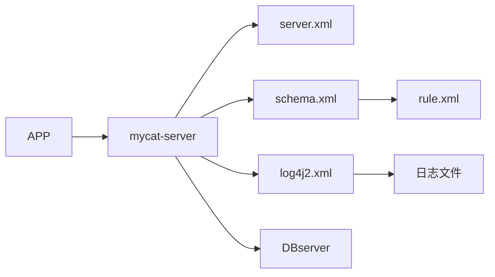

这是摘要
<!-- more -->

------

# mycat配置文件概述

## 配置文件依赖关系

### server.xml

1. 系统相关参数
2. 用户访问权限
3. sql防火墙，屏蔽一些特殊的sql语句，控制访问者主机ip。
4. sql拦截器功能，记录特定 sql 的日志。

### rule.xml

常用分片算法

- 简单取模 - partitionByMod，对column直接取模

  只能用在整数类型的表

- 哈希取模 - partitionByHashMod，对 column 先进行hashcode计算后再取模

  可以用在字符串类型的表

- 字符串范围取模 - partitionByPrefixPattern，字符串转ASCII码后，进行累加后再对取模基数进行取模。

  根据字符串的范围进行分片，比如订单号的后五位，日期的前3位，等。

- 分片枚举 - PartitionByFileMap， 根据列的值进行映射分表，

  列的值需要有限，枚举值与数据库映射关系配置在 mapFile 中。

### schema.xml

- 配置 逻辑库与物理库直接的关系
- 配置 逻辑库的具体分片rule
- 配置 物理库的连接信息

## mycat命令行操作

show @@help ，查看所有命令

reload @@config，重新加载配置文件。（重新加载的时候，系统是不可用的，高峰期的时候还是需要使用滚动重启的方式）

show @@databases，显示所有物理数据库

show @@datanodes，显示所有数据节点

