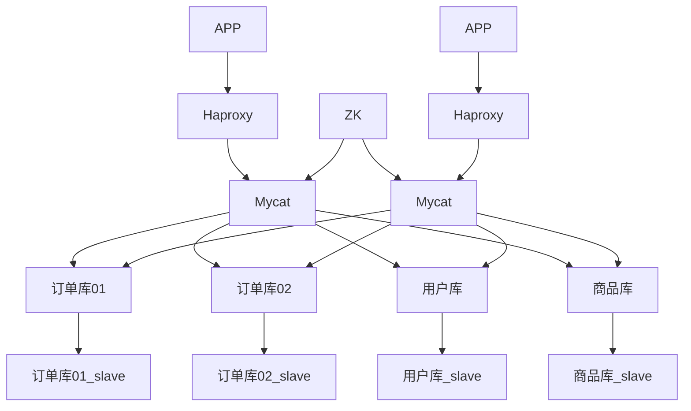

这是摘要
<!-- more -->

------


# mycat高可用方案


## Haproxy + Mycat + zookeeper + Mysql主从


### 架构图




### 实现步骤


#### 使用 zookeeper 管理 mycat 的配置文件

（schema.xml、server.xml、rule.xml、sequence_db_conf.properties）

1. 将 mycat/conf 下的配置文件 ，schema.xml server.xml rule.xml sequence_db_conf.properties 复制到 mycat/conf/zkconf下

2. 使用 bin/init_zk_data.sh 脚本 将mycat配置信息初始化到zk中。

   配置信息存在于 zk 中的/mycat/mycat-cluster-1下面

3. 配置mycat，使用zk模式启动，配置 myid.properties 中的内容

   ```properties
   loadZK=true
   zkURL=192.168.x.x，192.168.x.x，192.168.x.x，
   clusterId=mycat-cluster-1
   myid=mycat_01 [mycat集群中，本实例的id，该值不能重复]
   clusterSize=2 [有多少个mycat实例]
   clusterNodes=mycat_01,mycat_02 [全部的mycat实例id]
   ```

4. 使用 mycat start 重启mycat

5.  后续维护配置信息，只要修改zk中的配置即可。可以使用 1，2步骤对zk中的配置进行修改


#### **使用 HAProxy 实现 mycat的 LB & HA**

1. 安装HAProxy，并使用 Keepalived 监控 HAProxy。
2. 配置 HAProxy 监控 Mycat
3. 配置应用通过 VIP 访问 HAProxy


#### **mycat 配置 mysql 主从读写分离**

1. 配置 mysql ，直线主从复制

2. 配置 mycat 对后端db 进行读写分离，修改schema.xml 中的dataHost标签，新增一个readHost

   ```xml
   <dataHost name="userHost" maxCon="1000" minCon="10" balance="0" writeType="0" dbType="mysql" dbDriver="native" switchType="1"> 
     <heartbeat>select user()</heartbeat>
     <!-- 主写，从读 -->
     <writeHost host="localhost" url="localhost:3306" user="user_db_user" password="123456" >
       <readHost host="192.168.1.6" url="192.168.1.6:3306" user="user_db_user" password="123456"/>
     </writeHost>
     <!-- 配置从库，读写。他可以保证主库挂掉的时候，读写操作都进入从库 -->
     <writeHost host="192.168.1.6" url="192.168.1.6:3306" user="user_db_user" password="123456" />
   </dataHost>
   ```

3. 滚动重启mycat
